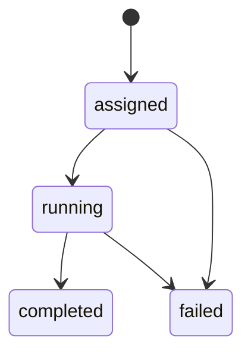

# Thalamus Runtime Reference Design

## 目的

Python版Thalamus Runtimeを、Rust移行前にprotocol準拠の最小reference implementationとして整合させる。対象はRuntime中核、EventBus、Publisher、Validator、Registry、Tool mediation、Mock LLM path、TaskState、Example、README Statusであり、ZooCodeCustom、Cingulater本体、Rust実装は対象外とする。

## Index Probe

- query: Python Thalamus Runtime protocol reference implementation canonical event envelope dict EventBus validator payload models agent registry flow tool mediation mock LLM task state examples README pydantic dependency
- path: workspace root
- 主要候補: [`runtime/events/types.py`](../runtime/events/types.py:11), [`runtime/runtime.py`](../runtime/runtime.py:6), [`README.md`](../README.md:378)
- 補足候補: [`runtime/events/publisher.py`](../runtime/events/publisher.py), [`runtime/bus/interface.py`](../runtime/bus/interface.py), [`runtime/events/validator.py`](../runtime/events/validator.py), [`examples/simple-task-flow/`](../examples/simple-task-flow/)

## 現状差分の要約

- [`RuntimeEvent`](../runtime/events/types.py:53) は `type`、`source`、`payload` のみを持ち、canonical envelopeとして必要な `id`、`subject`、`timestamp`、`schema`、`correlation_id`、`causation_id`、`metadata` が未定義。
- [`ThalamusRuntime`](../runtime/runtime.py:6) はNATS固定の初期化と `runtime.agent.register` / `runtime.agent.unregister` を扱うが、protocol上の `runtime.agent.ready` / `runtime.agent.exit` / `runtime.agent.error` registry flow とずれている。
- [`README.md`](../README.md:378) のStatusは、LLM pathとtool mediationを未実装としており、今回のreference runtimeでは最小実装へ昇格させる。

## 設計原則

1. canonical event envelopeを全runtime eventの唯一の外部契約にする。
2. reference実装は外部NATSを必須にせず、dict/listベースのin-memory EventBusでprotocol挙動を検証可能にする。
3. payload modelはPydanticで契約を固定し、validatorはsubjectごとにpayload modelを選択する。
4. Runtimeは同期的な直接呼び出しではなく、EventBus上のsubjectとevent envelopeでregistry、task、tool、LLMを接続する。
5. 最小referenceの範囲では実LLM、実MCP、分散NATS、永続化、Rust移行後のAPI最適化は行わない。

## コンポーネント責務

### Runtime

- 責任: EventBus接続、event handler登録、agent lifecycle、task state、tool mediation、mock LLM responseの調停。
- インターフェース案:
  - `ThalamusRuntime(bus: EventBus | None = None, llm: LLMProvider | None = None, tools: ToolRegistry | None = None)`
  - `async start() -> None`
  - `async stop() -> None`
  - `async publish(subject: str, payload: dict, source: str, correlation_id: str | None = None) -> RuntimeEvent`
  - `async handle_event(subject: str, event: dict) -> None`
- 受信subject:
  - `runtime.agent.ready`
  - `runtime.agent.exit`
  - `runtime.agent.error`
  - `runtime.task.assign`
  - `runtime.task.assign.<agent_id>`
  - `runtime.tool.request`
  - `runtime.llm.request`
- 発行subject:
  - `runtime.task.result`
  - `runtime.tool.result`
  - `runtime.llm.response`
  - `runtime.agent.error`

### EventBus

- 責任: reference runtime向けのin-memory publish/subscribe、subject matching、発行済みevent履歴の保持。
- インターフェース案:
  - `async connect() -> None`
  - `async close() -> None`
  - `async publish(subject: str, event: dict) -> None`
  - `async subscribe(subject: str, handler: Callable[[str, dict], Awaitable[None]]) -> None`
  - `published: list[tuple[str, dict]]`
- subject matching:
  - 完全一致を必須。
  - 最小referenceでは `runtime.>` と `runtime.task.*` のwildcardだけを任意対応にし、NATS互換の完全再現は非対象。

### Publisher

- 責任: subject、source、payloadからcanonical event envelopeを生成し、validator通過後にEventBusへ発行する。
- Runtimeが発行する全eventは、`runtime.task.result`、`runtime.tool.result`、`runtime.llm.response`、`runtime.agent.error` を含めてPublisherを経由する。handlerが `EventBus.publish()` へ部分dictを直接渡すことは禁止する。
- インターフェース案:
  - `async publish(subject: str, source: str, payload: dict, correlation_id: str | None = None, causation_id: str | None = None, metadata: dict | None = None) -> RuntimeEvent`
- envelope生成:
  - `id`: UUID文字列。
  - `type`: subjectと同じ値。既存API互換のため残すがcanonical識別子は `subject` とする。
  - `subject`: runtime subject。
  - `source`: runtime component identifier。
  - `timestamp`: UTC ISO 8601文字列。
  - `schema`: subjectに対応するschema idまたは短縮schema key。
  - `payload`: subject別payload modelで検証済みdict。
  - `correlation_id` / `causation_id`: request-response連鎖用。未指定なら `None`。
  - `metadata`: 空dictを既定値。

### Validator と Payload Models

- 責任: subject別payload modelの選択、canonical envelope必須フィールドの検証、未知subjectの拒否または明示的pass-through。
- task assignは現行Green済みのcanonical payloadを採用する。raw taskの目的や任意入力はtop-level `objective` ではなく `input` または `metadata` に入れ、Runtimeはtop-level `objective` を要求しない。
- 最小payload:
  - `runtime.task.assign`: `task_id`, `agent_id`, `input | dict`, `capabilities | list[str]`, `metadata | dict`
  - `runtime.task.result`: `task_id`, `status`, `summary | None`, `result | dict | None`
  - `runtime.agent.ready`: `agent_id`, `capabilities`
  - `runtime.agent.exit`: `agent_id`, `reason | None`
  - `runtime.agent.error`: `agent_id | None`, `error`, `task_id | None`
  - `runtime.tool.request`: `request_id`, `task_id | None`, `capability`, `input`, `agent_id | None`
  - `runtime.tool.result`: `request_id`, `task_id`, `status`, `output | Any | None`, `error | str | None`
  - `runtime.llm.request`: `request_id`, `task_id | None`, `prompt`, `model | None`, `agent_id | None`
  - `runtime.llm.response`: `request_id`, `task_id`, `status`, `text | None`, `model`, `error | str | None`
- `pydantic` はreference runtimeの契約固定に必要な依存として [`pyproject.toml`](../pyproject.toml) に残す。

### Registry

- 責任: `runtime.agent.ready` でagentを登録し、`runtime.agent.exit` と `runtime.agent.error` で状態を更新する。
- 状態:
  - `ready`: agentがtask受領可能。
  - `exited`: agentが通常終了。
  - `error`: agentが異常状態。
- インターフェース案:
  - `register_ready(agent_id: str, capabilities: list[str]) -> None`
  - `mark_exit(agent_id: str, reason: str | None) -> None`
  - `mark_error(agent_id: str | None, error: str, task_id: str | None = None) -> None`
  - `find_by_capability(capability: str) -> list[str]`

### Tool Mediation

- 責任: workerからの `runtime.tool.request` をruntimeが受け、許可済みcapabilityへ委譲し、`runtime.tool.result` を発行する。
- 最小実装:
  - `ToolRegistry` は `dict[str, Callable[[dict], Awaitable[dict] | dict]]`。
  - 未登録capabilityは `status: "error"` と `error` を持つ `runtime.tool.result` を返す。
  - `runtime.tool.result` はPublisherでcanonical envelopeを生成し、`id`、`timestamp`、`metadata`、`correlation_id`、`causation_id` を保持する。
  - 実MCP routing、streaming、timeout retry、権限ポリシーの完全実装は非対象。

### Mock LLM Path

- 責任: `runtime.llm.request` を受け、mock providerで `runtime.llm.response` を返す。
- 最小実装:
  - `MockLLMProvider.complete(prompt: str, model: str | None = None) -> str`
  - 既定応答は入力promptを含む決定的な文字列にする。
  - `runtime.llm.response` はPublisherでcanonical envelopeを生成し、`id`、`timestamp`、`metadata`、`correlation_id`、`causation_id` を保持する。
  - 実Cingulater連携、OpenAI互換HTTP、token streaming、embeddingは非対象。

### Task State

- 責任: `runtime.task.assign` 受信からresult/errorまでの最小状態遷移を保持する。
- 状態遷移:

- `runtime.task.assign` 受信で `assigned`。
- LLM/tool mediation開始で `running`。`runtime.task.assign` handler内で即時 `running` へ進めてはいけない。
- `runtime.task.result` 成功で `completed`。
- `runtime.agent.error` または mediation失敗で `failed`。

### Examples

- [`examples/simple-task-flow/`](../examples/simple-task-flow/) をreference runtimeの実行例として更新する。
- 期待flow:
  1. in-memory runtime起動。
  2. agentが `runtime.agent.ready` をpublish。
  3. task assignをpublish。
  4. runtimeがmock LLMとtool mediationを通す。
  5. `runtime.task.result` がpublish履歴に残る。

### README Status

- [`README.md`](../README.md:378) はreference implementationの状態に合わせて更新する。
- `runtime.llm.request` / `runtime.llm.response` と `runtime.tool.request` / `runtime.tool.result` は「minimal reference implemented」と表現する。
- NATS、Cingulater、MCP gateway、多plane完全実装は引き続き未実装または設計段階として明記する。

## 非対象

- ZooCodeCustomと連携したプロダクト実装。
- Cingulater本体、実LLM provider、OpenAI互換HTTP接続。
- Rust runtime実装、Rust API設計、移行コード生成。
- MCP gateway本体、外部tool実行基盤、権限ポリシー完全実装。
- NATS分散運用、永続化、replay、observability基盤。
- UI、IDE extension、パッケージ公開、version tag pushの実行。

## GitHub終了ゲート

GitHub Integration Stateは `github`、owner/repoは `globalpocket/thalamus`。実装・テスト・Coverage 85%以上・security-auditor・reviewerが完了した通常対応では、後続Orchestratorがrelease-managerによるversion/tag pushとdiagnostic-reporterによる診断Issue登録を終了ゲートとして扱う。ただし本Architectサブタスクは設計・計画Markdown生成のみであり、GitHub MCP、release、diagnostic Issue作成は行わない。
